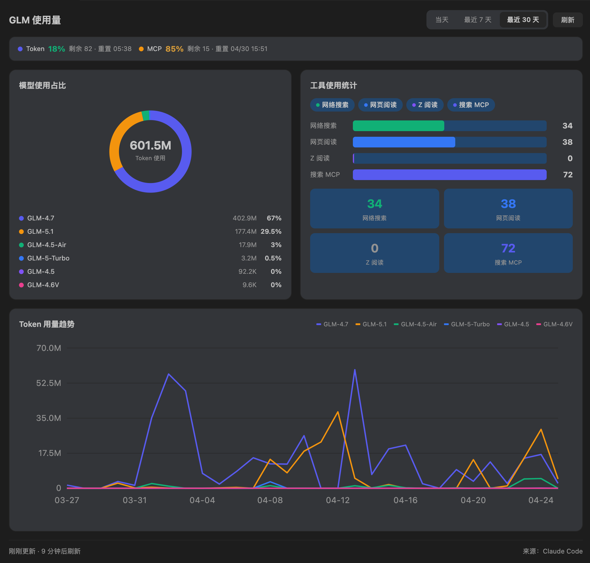
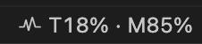
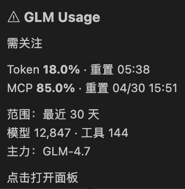

# ZAI Usage Monitor

> 在 Visual Studio Code 中直接监控您的 ZAI Coding Plan 使用量

## 界面预览

<table>
  <tr>
    <td align="center"><b>详情面板</b></td>
    <td align="center"><b>状态栏</b></td>
     <td align="center"><b>Tooltip</b></td>
  </tr>
  <tr>
    <td></td>
    <td></td>
    <td></td>
  </tr>
</table>

## 功能特性

### 配额监控
- **Token 配额进度条**：可视化展示 Token 配额使用百分比，进度条颜色随用量变化（绿→黄→红）
- **MCP 配额进度条**：实时显示 MCP 工具调用配额，含已用/总量和重置时间
- **状态栏集成**：精简格式显示用量百分比 `T{token}% · M{mcp}%`，悬停查看详细 Tooltip

### 数据统计
- **快速统计卡片**：一排展示 4 个核心指标 —— Token 消耗总量、模型调用次数（含平均每次 token 数）、工具调用次数、主力模型
- **模型使用占比环形图**：可视化展示各模型 Token 使用占比，下方图例列出模型名称、用量和百分比
- **模型详细表格**：列出每个模型的 Token 用量和占比
- **工具使用柱状图**：彩色标签 + 柱状图展示各工具调用次数，底部数字卡片强化数据对比
- **工具详情表格**：展示所有工具的调用次数和占比

### 趋势分析
- **Token 趋势折线图**：按模型分色展示 Token 用量随时间的变化趋势，支持 hourly/daily 粒度自适应
- **趋势面积填充**：总量趋势区域半透明填充，直观展示整体用量走势

### 其他
- **离线支持**：断网时自动回退缓存数据，并显示离线标识
- **套餐类型展示**：自动识别并显示当前套餐类型
- **时间窗口分析**：支持今日、近 7 天、近 30 天三种时间范围
- **安全凭证存储**：API 密钥安全存储在 VS Code 的 secret storage 中
- **自动配置**：自动读取 Claude Code 配置文件中的凭证

## 系统要求

- Visual Studio Code 1.80.0 或更高版本
- ZAI Coding Plan API 凭证

## 安装

1. 打开 Visual Studio Code
2. 进入扩展面板（Ctrl+Shift+X）
3. 搜索 "ZAI Usage Monitor"
4. 点击安装

## 快速开始

### 方式一：自动配置（推荐）

如果您已经配置了 Claude Code，扩展会自动使用 `~/.claude/settings.json` 中的凭证，无需额外配置。

### 方式二：手动配置

1. **配置 API 凭证**
   - 打开命令面板（Ctrl+Shift+P / Cmd+Shift+P）
   - 输入 `ZAI` 筛选命令
   - 选择 "ZAI Usage: 配置 ZAI 使用量监控"
   - 输入您的 API Base URL（默认：`https://api.z.ai/api/anthropic`）
   - 输入您的 API 密钥

2. **查看使用量**
   - 点击状态栏右侧的 ZAI 用量项
   - 或通过命令面板运行 "ZAI Usage: 显示 ZAI 使用量面板"

## 面板说明

面板由上至下包含以下区域：

### 1. 顶部控制栏
标题栏显示 "ZAI 套餐" 和套餐类型标签，右侧包含：
- **时间范围切换**：当天 / 最近 7 天 / 最近 30 天
- **刷新按钮**：手动刷新数据

### 2. 配额进度条
并排展示两张配额卡片：

| 卡片 | 内容 |
|------|------|
| Token 配额 | 进度条 + 百分比 + 已用百分比 + 重置时间 |
| MCP 配额 | 进度条 + 百分比 + 已用/总量 + 重置时间 |

进度条颜色含义：
- **绿色**（< 80%）：正常
- **黄色**（80% - 95%）：需注意
- **红色**（≥ 95%）：高风险

### 3. 快速统计卡片
4 个统计指标卡片：

| 指标 | 说明 |
|------|------|
| Token 消耗 | 当前时间段内消耗的 Token 总量，下方显示精确数字 |
| 模型调用 | 模型调用总次数，下方显示平均每次调用消耗的 Token 数 |
| 工具调用 | MCP 工具调用总次数，下方显示工具调用占模型调用的比例 |
| 主力模型 | 使用量最高的模型名称，下方显示其 Token 消耗量 |

### 4. 模型使用占比 + 工具使用统计
左右两栏布局：

**左侧 - 模型使用占比**
- 环形图展示各模型 Token 占比
- 图例列出模型名称、Token 用量、百分比
- 下方表格展示模型详细数据（名称、Token 用量、占比）

**右侧 - 工具使用统计**
- 彩色工具标签
- 柱状图展示各工具调用次数对比
- 数字卡片展示各工具精确调用次数
- 下方表格展示所有工具详情（名称、调用次数、占比）

### 5. Token 用量趋势
折线图展示 Token 用量随时间的变化：
- 每个模型独立一条线，颜色对应上方环形图
- 半透明面积填充展示总量走势
- 支持 hourly（按小时）和 daily（按天）粒度自动切换

### 6. 页脚
左侧显示刷新状态（更新时间、下次刷新倒计时），右侧显示凭证来源。

## 状态栏

状态栏显示当前用量百分比，格式为 `T{token}% · M{mcp}%`。颜色随用量变化：

- 绿色：< 80%
- 黄色：80% - 95%
- 红色：≥ 95%

悬停状态栏可查看详细 Tooltip，包含：
- Token / MCP 配额百分比和重置时间
- 当前查询范围
- Token 消耗总量、调用次数、平均每次消耗
- 模型数量、工具调用次数
- 主力模型名称和用量
- 最常用工具

## 命令

通过命令面板（Ctrl+Shift+P / Cmd+Shift+P）输入 `ZAI` 筛选以下命令：

| 命令 | 描述 | 使用场景 |
|------|------|----------|
| `ZAI Usage: 显示 ZAI 使用量面板` | 打开使用量详情面板 | 查看完整数据 |
| `ZAI Usage: 刷新 ZAI 使用量` | 立即刷新数据并弹出通知 | 手动更新数据 |
| `ZAI Usage: 配置 ZAI 使用量监控` | 配置 API 凭证 | 首次使用或更换凭证 |
| `ZAI Usage: 清除 ZAI API 凭证` | 清除已存储的 API 凭证 | 注销或更换账号 |
| `ZAI Usage: 诊断 ZAI 使用量凭证` | 诊断凭证配置问题 | 排查凭证获取失败 |

## 设置

通过 VS Code 设置（Ctrl+, / Cmd+,）搜索 `zai` 查看：

| 设置 | 类型 | 默认值 | 描述 |
|------|------|--------|------|
| `glmUsage.baseUrl` | string | `https://api.z.ai/api/anthropic` | ZAI API 基础 URL |
| `glmUsage.refreshInterval` | number | `600000` | 自动刷新间隔（毫秒，默认 10 分钟） |
| `glmUsage.autoRefresh` | boolean | `true` | 启用/禁用自动刷新 |
| `glmUsage.statusBarMode` | string | `detailed` | 状态栏模式：minimal（仅百分比）/ compact（Token+MCP百分比）/ detailed（Token和MCP） |
| `glmUsage.cacheEnabled` | boolean | `true` | 启用/禁用数据缓存 |
| `glmUsage.cacheTTL` | number | `300` | 缓存有效期（秒，默认 5 分钟） |
| `glmUsage.notificationThresholds` | number[] | `[50, 80, 95]` | 用量阈值提醒百分比 |
| `glmUsage.notificationEnabled` | boolean | `true` | 启用/禁用用量阈值提醒 |

## 凭证配置优先级

扩展按以下优先级获取 API 凭证：

1. **Claude Code 配置文件** (`~/.claude/settings.json`) — 推荐，安装即用
2. **VSCode 进程环境变量** — 适合 CI/CD 环境
3. **手动配置的凭证** — 通过命令面板配置

## 常见问题

### Q: 状态栏显示 "ZAI 未配置"
扩展未找到 API 凭证。请确认以下任一方式已配置：
- Claude Code 已安装并配置（自动读取 `~/.claude/settings.json`）
- 运行 "ZAI Usage: 配置" 命令手动输入凭证
- 设置环境变量 `ANTHROPIC_AUTH_TOKEN` 和 `ANTHROPIC_BASE_URL`

### Q: 面板显示 "离线缓存"
网络不可用，当前展示的是最后一次成功获取的缓存数据。恢复网络后下次刷新会自动更新。

### Q: 如何关闭用量提醒？
在 VS Code 设置中搜索 `glmUsage.notificationEnabled`，取消勾选即可。

## 隐私与安全

- 您的 API 密钥安全存储在 VSCode 的 secret storage 中
- 不向任何第三方服务发送使用量数据
- 所有 API 调用直接发送到配置的 ZAI API 端点

## 许可证

MIT License - 详见 [LICENSE](LICENSE)

## 支持

如有问题、功能建议或疑问，请提交 Issue

## 更新日志

详见 [CHANGELOG.md](CHANGELOG.md)
